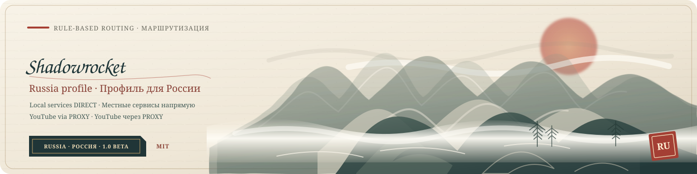

<div align="center">

**简体中文**　 | 　[Русский](README.ru.md)　 | 　[English](README.md)



# Shadowrocket-RU-CN-Routing

**面向俄罗斯网络 · 俄罗斯与中国服务直连 · YouTube 按规则代理**

`Russia v2.0 Beta`　 `340 条规则`　 [**MIT License**](LICENSE)

[分流策略](#routing) · [配置与使用](#quick-start) · [Beta 说明](#beta) · [参与维护](#contributing) · [法律与捐赠](#support)

</div>

---

> [!IMPORTANT]
> **项目已发布到 GitHub。** 仓库包含用户提供的 Russia v2.0 Beta 原文件，内容未修改；已完成规则结构、数量与关键顺序的静态核对。尚未在 Shadowrocket 中实际导入，也未在俄罗斯当地网络实测。可使用下方 Raw 链接下载。

<a id="overview"></a>

## 这个项目是做什么的？

这是给**在俄罗斯使用 Shadowrocket、并且已有自己的代理节点或订阅**的用户准备的分流配置。它解决的是：开启代理访问所需服务时，让常用俄罗斯网站和中国服务仍按规则直连，同时把指定国际服务交给代理。

Russia v2.0 Beta 会将俄罗斯银行、支付、政府、大学、运营商、交通、电商和媒体等域名，以及微信、支付宝、淘宝等中国服务设为 **DIRECT**；Google 通用服务设为 **DIRECT**；配置中列出的 YouTube、YouTube Music、X、Instagram、Telegram 等代理例外设为 **PROXY**。经过这些规则后，未匹配的其余流量由 `FINAL,PROXY` 交给你自己的代理。

**DIRECT** 是通过当前网络直连；**PROXY** 是使用你在 Shadowrocket 中选择的节点。此项目只提供分流规则，不提供 VPN 服务、代理节点或节点订阅。

当前仓库只包含俄罗斯使用配置。中国服务直连规则属于这份 Russia 配置的一部分；中国模式配置将由维护者单独开源。

<a id="routing"></a>

## 分流策略

以下策略已与收录文件静态对照；服务是否可达、App 是否完整覆盖仍需实测。

| 流量 / 服务 | Russia v2.0 Beta | 处理方式 |
| :--- | :---: | :--- |
| 俄罗斯银行、支付、政府、大学等 | **DIRECT** | 常用服务独立域名规则 |
| 中国常用服务 | **DIRECT** | 微信、支付宝、淘宝等显式规则 |
| Google 非 YouTube 服务 | **DIRECT** | Google 通用域名规则；具体功能依赖仍需验证 |
| YouTube / YouTube Music | **PROXY** | 列出的站点、API 与视频流规则优先 |
| YouTube 视频流 `googlevideo.com` | **PROXY** | 独立域名规则 |
| `.ru` / `.su` / `.рф` 及中国地区域名 | **DIRECT** | 后置地区域名兜底 |
| 局域网与 `GEOIP,RU` / `GEOIP,CN` | **DIRECT** | 后置地址规则 |
| 其余未命中流量 | **PROXY** | `FINAL,PROXY` |

Google 搜索、Gmail、Maps、Drive、Translate、Photos、Play 等非 YouTube 服务按上述通用域名策略处理，不承诺覆盖所有接口。

### 俄罗斯：先细分服务，再进行地区兜底

| 分类 | 文件中列出的服务示例 | 策略 |
| :--- | :--- | :---: |
| 🏦 银行 | Sber、T-Bank、VTB、Alfa-Bank 等 | **DIRECT** |
| 💳 支付 | Mir / NSPK、SBPay、YooMoney 等 | **DIRECT** |
| 🏛️ 政府机构 | Gosuslugi、税务机关、央行等 | **DIRECT** |
| 🎓 大学 | УрФУ、МГУ、СПбГУ、НИУ ВШЭ、ИТМО 等 | **DIRECT** |
| 📚 教育平台 | OpenEdu、Stepik 等 | **DIRECT** |
| 📱 运营商 | MTS、MegaFon、Beeline、T2 等 | **DIRECT** |
| 🛍️ 电商与生活 | Ozon、Wildberries、Avito、Yandex 等 | **DIRECT** |
| 🚆 交通与出行 | RZD、Aeroflot、S7 等 | **DIRECT** |
| 📺 本地影音 | Rutube、VK Video、Kinopoisk 等 | **DIRECT** |

地区兜底覆盖未单列的站点，不能代替对银行登录、大学课程系统或 App 接口的具体维护。`.рф` 在规则中使用 Punycode：`xn--p1ai`。

### 规则顺序与共享域名

1. 先处理 YouTube、YouTube Music、视频流及其他明确的代理例外。
2. 再处理 Google 通用域名、俄罗斯机构与中国服务的直连规则。
3. 最后放地区域名、局域网、GEOIP 与最终兜底规则。

文件中的 `youtubei.googleapis.com`、`youtube.googleapis.com` 等例外已置于 `googleapis.com` 直连规则之前。**部分 Google / YouTube 资源使用共享域名**：原配置中的 `ggpht.com` 与 `www.googleapis.com` 会走 DIRECT。因此不能保证所有 YouTube 请求完全隔离；修改共享域名也可能影响其他 Google 服务。

<a id="quick-start"></a>

## 配置与使用

| 配置 | 文件 | 验证状态 |
| :--- | :--- | :--- |
| **Russia v2.0 Beta** | [仓库文件](configs/Russia.conf) · [Raw 直接下载](https://raw.githubusercontent.com/Emptydesire/Shadowrocket-RU-CN-Routing/main/configs/Russia.conf) | 原文件已收录；客户端与网络待测 |

**340 条规则**：333 条域名后缀、4 条 IP 网段、2 条 GEOIP、1 条最终规则；共 291 条 DIRECT、49 条 PROXY。未发现完全重复的规则行。统计不等于 340 个服务，也不代表实测通过。完整记录见 [静态核对报告](docs/VALIDATION.md#zh-cn)。

### 导入本地文件

Shadowrocket 支持通过 URL 或 iCloud Drive 导入规则文件（[开发者 App Store 介绍](https://apps.apple.com/us/app/shadowrocket/id932747118)）。

1. 备份当前配置，准备你自己的可用代理节点。
2. 保存本文件包中的 `configs/Russia.conf`，在 Shadowrocket 的配置页面导入。
3. 选择 Russia 配置，将路由方式设为按配置规则处理，并选择可用代理节点。
4. 检查连接日志中的匹配规则与实际策略，分别测试本地常用服务、Google 与 YouTube。
5. 记录网络、版本与具体域名；出现回归时切回备份并反馈。

按钮名称可能随客户端版本和界面语言变化。当前配置使用系统 DNS，并关闭 IPv6；静态核对不等于客户端兼容性或 DNS 行为验证。

### Raw 远程配置

已发布的 [Russia.conf Raw 文件](https://raw.githubusercontent.com/Emptydesire/Shadowrocket-RU-CN-Routing/main/configs/Russia.conf) 可用于直接下载，或添加到 Shadowrocket 的远程配置中。Raw 地址提供原始配置内容，不是 `blob` 预览页（[GitHub 官方说明](https://docs.github.com/en/repositories/working-with-files/using-files/viewing-and-understanding-files#viewing-or-copying-the-raw-file-content)）。

当前 `main` 分支的 Raw 地址：

```text
https://raw.githubusercontent.com/Emptydesire/Shadowrocket-RU-CN-Routing/main/configs/Russia.conf
```

将当前 Raw 地址添加到 Shadowrocket 的远程配置功能中，下载后选择该配置。**这是配置地址，不是代理节点订阅地址**；更新规则不会提供节点。分支地址可随维护更新，固定提交便于复现；刷新前备份本地修改，不承诺客户端自动定时更新。

维护者可参考 [维护与版本发布说明](PUBLISHING.md)。

<a id="beta"></a>

## Russia v2.0 Beta 说明

> [!WARNING]
> 尚未完成 Shadowrocket 实际导入或俄罗斯当地运营商测试。DIRECT / PROXY 表示路由策略，不代表服务一定可达，也不代表所有 App 接口已经覆盖。

- Google 直连效果可能随运营商、DNS 和服务自身变化；共享域名可能使部分 YouTube 资源直连。
- 地区域名与 GEOIP 只能提供粗粒度兜底，无法识别所有服务；国际服务例外需持续维护。
- 当前检查只覆盖文件内容与关键规则关系，不提供连接质量、速度或稳定性保证。
- 更新前保留可用配置，并以实际连接日志确认路由结果。

<a id="contributing"></a>

## 维护与贡献

欢迎用中文、俄语或英语反馈俄罗斯网络测试结果、修正规则与改进文档。可通过 GitHub Issues 或 Pull Requests 参与，流程见 [贡献指南](CONTRIBUTING.md#zh-cn)。

反馈请包含配置版本、Shadowrocket 版本、测试日期、运营商与网络类型、问题域名、期望与实际策略、复现步骤。地理信息按隐私需要提供；日志去除节点信息、订阅令牌、账号与无关访问记录。

优先修正具体服务与规则顺序，再调整地区兜底。同步三语文档，并在 [更新日志](CHANGELOG.md) 区分静态检查、实际通过与未测试的项目。

<a id="support"></a>

## 法律声明与自愿捐赠

### 法律声明

本项目仅供学习与技术交流，不鼓励、组织或授权任何违法或犯罪行为。用户须自行确保使用符合适用法律法规。用户使用本项目或其内容独立从事的违法犯罪活动，属于用户个人行为，不代表本项目或开发者本人，相关责任由行为人自行承担。本声明不排除依法不能排除的责任。

### 自愿捐赠

如愿意支持项目维护，可自愿捐赠；**仅接受 USDT 或 USDC**。捐赠不构成购买，也不保证提供任何服务或回报。

[查看完整三语说明](SUPPORT.md#zh-cn)

| 网络 | 接收地址 |
| :--- | :--- |
| **BNB Chain** | `0xba16652ff3fa0d5b726ce1bb97e9c28bc9bc5efc` |
| **TRON Chain** | `TFaTEkxQFtF6SV67qhHgg4kPqwHU4ZQgyb` |

转账前请确认代币与所选网络相符，并仔细核对接收地址。链上转账通常无法撤回。

<a id="license"></a>

## 开源许可

本项目原创内容采用 [MIT License](LICENSE)。引入的第三方规则仍需遵守各自许可并保留必要署名。项目为社区维护，与 Shadowrocket 官方无隶属关系。

---

<div align="center">

**简体中文**　 | 　[Русский](README.ru.md)　 | 　[English](README.md)

清楚的规则 · 可复现的反馈 · 持续维护

</div>
